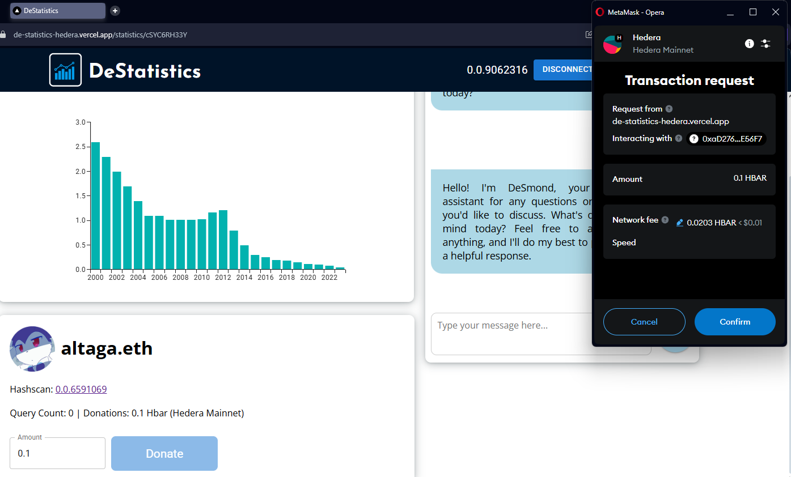

# DeStatistics


DeStatistics is a Web3 platform where AI Agents verify public data, ensure transparency, and reward contributors.

# Fast Links:

### Check it out! it is live and on Hedera Mainnet!:
- [**Web Page**](https://de-statistics-hedera.vercel.app/)
- [**Demo Video**](pending...)

## System Diagram:


- Hedera Native: 
  - [Hedera File Service](#file-storage-service): We used this service to provide a secure and decentralized source of storage for AI Agents in the databases and their verification and version control creating an auditable trail.
  - [Hedera Token Service](#ai-agent-tools): Utilizamos este servicio para realizar nuestro DES token.

- [Hedera AgentKit](#hedera-agentkit): 
  - With this service running on our langchain workflow we distribute rewards of our DES ERC20 token based on the AI ​​DB verification results. 

- [Hedera EVM](#hedera-evm-interface):
  - We used the EVM to make donations to database uploaders

# File Storage Service:

Having a secure, fast, and, above all, accessible storage source for our platform and agents was vital to the implementation of a system like ours.


## Upload Database:

- The user uploads their database and fills in the information required by the platform. We provide you with an [Example DB](./example-db/Taxes%20on%20exports.csv) ready to be uploaded to the Platform.

    

- Once you've completed the form, simply press the Upload and Verify button. This will begin the automatic review process.

    

- As shown in the diagram, the verification process is automatic and the user only has to wait for their result to arrive and, if it is satisfactory, their rewards.

    

---
**All interactions with Hedera  at the code level are in the following links.**

- [getDB](./de-statistics/src/actions/hederaServer.js)
- [createAndPushFile](./de-statistics/src/actions/hederaServer.js)
- [updateMainDB](./de-statistics/src/actions/hederaServer.js)

## Version Control:

- Databases can be updated, so you can switch between database versions if they are available.

    

- If you click the button on the left, you can visually compare versions so you can review the differences between the data. This also provides a way to audit changes between datasets.

    

- And finally, at the bottom, we can see the raw data that has been modified completely. This allows us to audit the data from the source file.

    

- Finally, the file organization performed at the Hedera level involves uploading multiple databases, but using the latest version number.

    

- And in the general repository where we store file references and versions. These are saved as follows.

    ```json
    {
      "key": "cSYC6RH33Y",
      "uploader": "0.0.6591069",
      "source": "International Monetary Fund",
      "release": 1742712295,
      "updated": 1742712295,
      "title": "Taxes on exports",
      "description": "Taxes on exports (% of tax revenue)",
      "fileId": ["0.0.9049174", "0.0.9050701", "0.0.9052322"],
      "verified": true
    }
    ```

---
**All version control with Hedera at the code level are in the following links.**
- [getDB](./de-statistics/src/actions/hederaServer.js)
- [getAllFetch](./de-statistics/src/actions/hederaServer.js)

# Hedera EVM Interface:

La interfaz EVM de hedera es una forma sencilla que los usuarios puedan acceder a todas las funciones de DeStatistics con wallets como Metamask.

## Signature Verification:

- Cuando el usuario quiere interaccionar con nuestro AI Agent DeSmond, este tiene que realizar una firma para confirmar que es una wallet valida.

    

- Por el momento aunque pedimos una firma, este servicio de monetizara en el futuro costando 1 centavo de dollar por Query.

## Donations:

- Ademas de la compensacion de DES tokens que realizamos mediante nuestro AI Agent, tambien promovemos que los usuarios realicen donaciones de Hbar a los uploaders.

    

- Ademas todas las donaciones son gestionadas mediante nuestro smart contract en Hedera Mainnet y estas de muestran en el perfil del Uploader en cada Database.

    

---
**The full code for the Smart Contract and WebPage Interactions is in the following links:**

- [Smart Contract Code](./contracts/DeStatistics.sol)
- [Webpage Agent Interactions](./de-statistics/src/app/statistics/[db]/components/chat.js)

# Hedera AgentKit:

Within the entire concept of our platform, we have two functionalities that best represent the power of AI Agents with their interactions with the blockchain and decentralized data storage.

## Ai Agent Tools:

The chat within the platform is intended to provide the user with an assistant to resolve general queries or more complex tasks.

- Send Tokens as Rewards: The AI Agent can transfer our DES token to any user who uploads a database and the AI ​​validates it for addition to our site. This reward is subject to the following tool.

    ```javascript
    const transferToken = tool(
        async ({ token_id, to_account_id, amount }) => {
            console.log("hedera_transfer_token tool has been called");
            const transferResult = await hederaAgentKit.transferToken(
                TokenId.fromString(token_id),
                to_account_id,
                parseInt(amount) * 10 ** 3 // Send Tokens Length * 10 ** 3
            );
            return JSON.stringify({
                status: transferResult.status,
                amount: amount,
                unit: "DES",
            });
            },
            {
            name: "hedera_transfer_token_mod",
            description: `Transfer fungible tokens on Hedera
                Inputs (input is a JSON string):
                token_id: string, the ID of the token to transfer e.g. 0.0.123456,
                to_account_id: string, the account ID to transfer to e.g. 0.0.789012,
                amount: number, the amount of tokens to transfer e.g. 100 in base unit`,
            schema: z.object({
                token_id: z.string(),
                to_account_id: z.string(),
                amount: z.string(),
            }),
        }
    );
    ```

  - DES Token Contract: 
    - https://hashscan.io/mainnet/token/0.0.9070830
  - DES Token Deploy Script:
    - [Script](./deploy-scripts/createToken.js)
  - DES Token EVM Interface:
    - [Contract Code](./contracts/DeSToken.sol)
  - Agent Code:
    - [Code](./hedera-agent-server/main.js)

- DB Analysis: The AI Agent can perform a complete analysis of a database by cross-checking it with the tools we'll discuss later and issue a verdict as to whether it's a valuable database or not. This verified data is then uploaded to the Recall network so it can be consumed by the website. [Example DB](./example-db/Taxes%20on%20exports.csv)

    ```javascript
    const ResponseFormatter = z.object({
        result: z
        .boolean()
        .describe(
            "Return True if the dataset meets all criteria and is deemed valid, or False if it does not."
        ),
    });
    ...
    const responseFormatterTool = tool(async () => {}, {
        name: "responseFormatter",
        description: `Evaluate the dataset—either as a complete set or a partial subset—by examining its quality, accuracy, completeness, consistency, and relevance to the intended real-world application. Ensure that the model remains capable of generating valid and reliable outputs, even when provided with incomplete or partial data. Determine the dataset's overall adequacy for its intended purpose.`,
        schema: ResponseFormatter,
    });
    ```

## AI Extra Tools:

- WebSearch: With this module, the agent can search for information on the Internet and thus provide the user with real-time information.

    ```javascript
    const webSearch = tool(
    ({ query }) => {
        console.log("Web Search Tool");
        let res = webSearchTool.invoke(query);
        return res;
    },
    {
        name: "web_search",
        description:
        "This tool allows users to perform accurate and targeted internet searches for specific terms or phrases. It activates whenever the user explicitly requests a web search, seeks real-time or updated information, or mentions terms like 'search,' 'latest,' or 'current' related to the desired topic.",
        schema: z.object({
        query: z.string(),
        }),
    }
    );
    ```
---
**The full code for the AI Agent and WebPage is in the following links:**

- [AI Agent Code](./hedera-agent-server/main.js)
- [Webpage Agent Interactions](./de-statistics/src/actions/hederaServer.js)