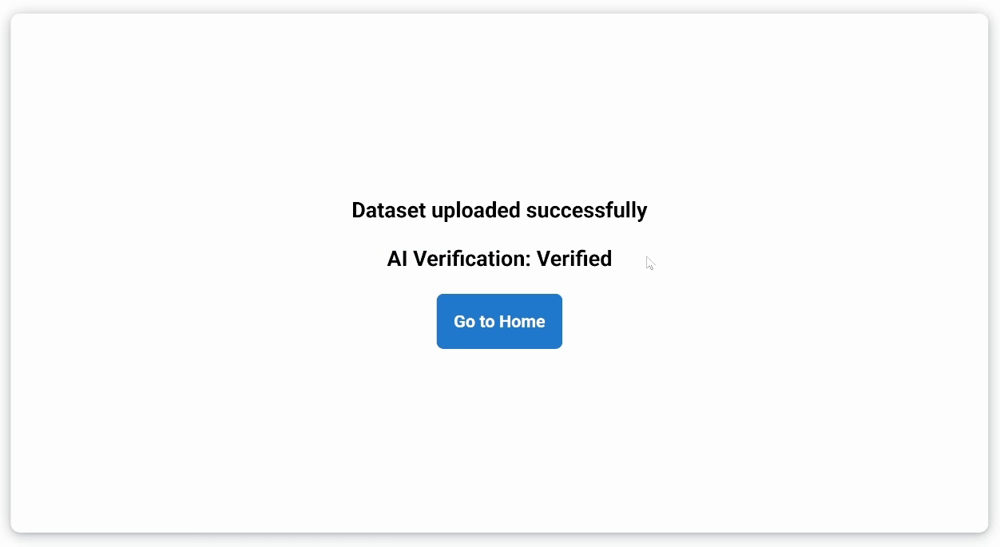

# Tutorial

Este es una pequeña guia para demostrar como se utiliza la plataforma web.

## Connect Wallet:

Primero tendremos que tener ya instalado en el navegador alguna wallet como Metamask.

Deberas presionar el boton de **Connect** en la esquine superior derecha.

Esto abrira un Modal que nos preguntara que tipo de wallet queremos utilizar, recomendamos utilizar la conexion por wallet.

Se abrirla la lista desplegable de todas las wallet que permiten conexion, en este caso seleccionaremos **Metamask**.

Esto abrira la wallet y ejecutara los siguientes comandos.

- Connect: Este comando conecta la wallet con la DApp.
- Add Hedera (only Once): Si la re de hedera no esta agregada a la Wallet esta se agrega para ser compatible con la DApp.
- Sign In: El sitio realiza un Sign In pare asegurarse que la wallet que interacciona con la DApp es la correcta y no una wallet falsa.

## Interact with Databases.

Abre cualquiera de las databases de la pagina principal o busca alguna de tu interes en la barra de busqueda.

Al abrir cualquiera de las databases tendras una ventana como esta, la cual explicaremos a detalle.

1. Ir al control de versiones.
2. Seleccion de la version a visualizar.
3. Seleccion del pais del cual queremos ver los datos.
4. Adjuntar la base de datos a la query que hagamos al aistente.

La ventana del es muy sencilla, unicamente teclea la query que deseas hacerle y este te contestara lo mejor que pueda, si deseas ver como funciona tecnicamente. [CLICK HERE](./README.md#ai-extra-tools)

Escribe la query en la ventana en el espacio de texto, presionando **Enter** o preisonando la flecha de envio, se mandara el mensaje, por ahora se esta pidiendo una firma para realizar las queries, sin embargo eventualmente cobraremos 1 centavo de hbar por query.

Finalmente el agente nos proporcionara la respuesta a la query.

La ventana de uploader, es una ventana que nos provee informacion del usuario que subio la dataset, las queries que se han hecho a la misma y a su vez una interfaz para relizar donaciones.

1. Nombre del usuario.
2. Address del usuario en Hedera Mainnet.
3. Numero que queries que se han hecho sobre la datase.
4. Cantidad en Hbar que ha recibido como donaciones el usuario por la DB.
5. Cantidad que el usuario desea donar a la DB.
6. Boton para ejecutar una donacion al usuario.

## Version Control:

En el caso de la pantalla de control de versiones, esta nos permite ver las diferencias entre cada una de las versiones de las databases, esto con el fin de asegurarnos que la data que verifico la AI fue correctamente aceptada en la plataforma.

En la seccion inferior de las databases podras ver todos los cambios que hay de una base a otra.

## Upload:

Realizar el upload de una nueva database a la palaforma es un prpceso que tenemos 100% automatizado, te mostramos como se realiza.

1. Presiona el boton de Upload que esta a la derecha del boton de Disconnect.

2. Una vez en la siguiente pantalla seleccionaremos si es una nueva version de una database ya existente o una database completamente nueva.

3. Segun sea el caso tendras que rellenar los campos de Title, Description y Source. Finalmente agregando en el campo de Choose File el archivo con la Database. Dejamos en este repositorio un ejemplo de una base de datos correctamente formateada y lista pra subir. [CLICK HERE](./example-db/Taxes%20on%20exports.csv)

4. Finalmente al presionar Upload and Verify solo tendras que esperar un poco menos de un minuto para ver el resultado.

5. Si todo salio bien y la base de datos es aceptada ademas de poder verla en nuestra plataforma lista para usarse, obtendras una cantidad de DES tokens en Mainnet.

