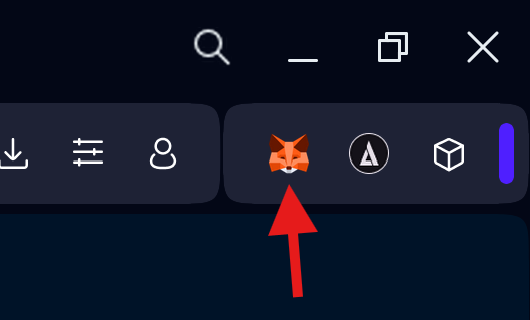

# Tutorial

This is a short guide to demonstrate how to use the web platform.

## Connect Wallet:

First, we will need to have a wallet like Metamask already installed in the browser.

You will need to press the **Connect** button in the top right corner.

This will open a Modal asking us what type of wallet we want to use. We recommend using the wallet connection.

The drop-down list of all the wallets that allow connection will open, in this case we will select **Metamask**.

This will open the wallet and execute the following commands.

- Connect: This command connects the wallet to the DApp.
- Add Hedera (only Once): If the Hedera network is not added to the wallet, it is added to be compatible with the DApp.
- Sign In: The site performs a sign-in to ensure that the wallet interacting with the DApp is the correct one and not a fake one.

## Interact with Databases.

Open any of the databases on the main page or search for one of your interest in the search bar.

When you open any of the databases, you will see a window like this, which we will explain in detail.

1. Go to version control.
2. Select the version you want to view.
3. Select the country you want to view data for.
4. Attach the database to the query you make in the wizard.

The window is very simple, just type the query you want to make and it will answer you as best it can, if you want to see how it works technically. [CLICK HERE](./README.md#ai-extra-tools)

Type the query in the window in the text space, pressing **Enter** or pressing the send arrow, the message will be sent, for now a signature is requested to make the queries, however eventually we will charge 1 cent of hbar per query.

Finally the agent will provide us with the answer to the query.

The uploader window provides information about the user who uploaded the dataset, the queries that have been made to it, and an interface for making donations.

1. Username.
2. User address on Hedera Mainnet.
3. Number of requests made on the database.
4. Amount in Hbar the user has received as donations from the database.
5. Amount the user wishes to donate to the database.
6. Button to make a donation to the user.

## Version Control:

In the case of the version control screen, it allows us to see the differences between each of the database versions, in order to ensure that the data verified by the AI ​​was correctly accepted into the platform.

In the lower section of the databases you can see all the changes that have occurred from one database to another.

## Upload:

Uploading a new database to the platform is a 100% automated process. We'll show you how to do it.

1. Press the Upload button to the right of the Disconnect button.

2. Once on the next screen we will select whether it is a new version of an existing database or a completely new database.

3. Depending on the case, you'll need to fill in the Title, Description, and Source fields. Finally, add the file containing the Database to the Choose File field. In this repository, we've provided an example of a properly formatted database ready for upload. [CLICK HERE](./example-db/Taxes%20on%20exports.csv)

4. Finally, when you press Upload and Verify, you'll only have to wait a little less than a minute to see the result.

5. If all goes well and the database is accepted, and you can view it on our platform ready to use, you will receive a number of DES tokens on Mainnet.

